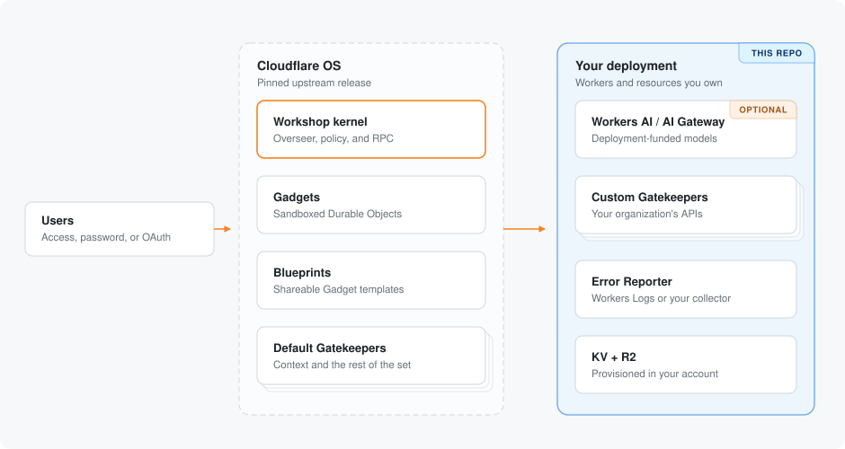

<p align="center">
  
</p>

<h1 align="center">Customized for your Company</h1>

<p align="center">
  Deploy a pinned Cloudflare OS release with branding, sign-in, integrations, routes, and upgrades under your control.
</p>

<p align="center">
  <a href="https://developers.cloudflare.com/workers/"></a>
  <a href="https://nodejs.org/"></a>
  <a href="https://pnpm.io/"></a>
  <a href="https://github.com/cloudflare/cloudflare-os"></a>
</p>

> [!IMPORTANT]
> Cloudflare OS is early-access software. Pin upstream releases, review changes, and verify the trust boundary before every production upgrade.

## Four steps

1. Install the dependencies and run `pnpm exec wrangler login`.
2. Fill in `deployment.jsonc`: account ID, Worker names, hostname, Access audience, admin emails.
3. Run `pnpm check`, then `pnpm deploy`.
4. Open `/admin` and set the site name, logo, and accent color; branding needs no redeploy.

[Deploy](#deploy) and [Customization](#customization) expand each step. Everything else on this page is optional reading.

## Overview

This repository adds deployment controls around a pinned [Cloudflare OS](https://github.com/cloudflare/cloudflare-os) release without modifying the upstream source.

| Control | What you own |
| --- | --- |
| Branding | Site name, logo, and accent color, changed in [`/admin`](docs/customization.md#branding) without a deploy |
| Identity | The sign-in method and administrator allowlist; this starter deploys [Cloudflare Access](https://developers.cloudflare.com/cloudflare-one/access-controls/applications/http-apps/self-hosted-public-app/) mode |
| Routing | A production [Custom Domain](https://developers.cloudflare.com/workers/configuration/routing/custom-domains/) or a `workers.dev` evaluation route |
| Data | Existing KV/R2 resources or [automatic provisioning](https://developers.cloudflare.com/workers/wrangler/configuration/#automatic-provisioning) |
| Integrations | Wrapper-owned Gatekeepers and service bindings without patching upstream |
| AI | No platform model by default; opt into [Workers AI](https://developers.cloudflare.com/workers-ai/) and [AI Gateway](https://developers.cloudflare.com/ai-gateway/) when needed |
| Operations | [Structured logs, traces, explicit error reports](docs/observability.md), validation, deployment order, and upgrades |

### Architecture



The deploy command derives temporary Wrangler files from upstream base configs, builds the frontend in Cloudflare Access mode, deploys the private Error Reporter and Gatekeepers before the Workshop, and removes generated files even on failure. Secrets never enter tracked configuration.

### If you only want branding

A hosted flow deploys the same upstream release to your Cloudflare account without this repository. It builds nothing locally, configures sign-in and your admin emails for you, and leaves the whole `/admin` surface intact: site name, logo, accent color, announcements, agent instructions, featured blueprints, and which connectors your users can reach. Built-in Gatekeepers such as GitHub and Google are still yours to connect with your own OAuth credentials.

<a href="https://os.cloudflare.app/deploy"></a>

Anything past that needs your own code or settings, which is what this repository is for: custom Gatekeepers, customized error reporting, your own Worker names, reusing storage you already have, choosing how much logging to keep, and a pinned version you upgrade when you decide. Hosted deployments also run on a `workers.dev` address, so deploy from here if you want the app on your own domain, or the email Gatekeeper, which needs a zone. Come back when branding stops being enough.

## Deploy

### 1. Prepare the workspace

Install [Node.js 24](https://nodejs.org/), [pnpm 11](https://pnpm.io/installation), and authenticate [Wrangler](https://developers.cloudflare.com/workers/wrangler/commands/#login):

```sh
git submodule update --init
pnpm install
pnpm --dir cloudflare-os install
pnpm exec wrangler login
```

Your account needs [Workers](https://developers.cloudflare.com/workers/), [KV](https://developers.cloudflare.com/kv/), [R2](https://developers.cloudflare.com/r2/), [Browser Rendering](https://developers.cloudflare.com/browser-rendering/), and [Dynamic Worker Loaders](https://developers.cloudflare.com/workers/runtime-apis/bindings/worker-loader/). AI products are optional.

### 2. Configure sign-in

Cloudflare OS supports several sign-in methods. This starter deploys [Cloudflare Access](https://developers.cloudflare.com/cloudflare-one/access-controls/applications/http-apps/self-hosted-public-app/) mode, which verifies identity before a request reaches the Worker. See [Sign-in methods](docs/customization.md#sign-in-methods) for the alternatives and what switching involves.

1. Choose a Workshop hostname in an [active Cloudflare zone](https://developers.cloudflare.com/dns/zone-setups/), such as `os.example.com`.
2. Create a [self-hosted Access application](https://developers.cloudflare.com/cloudflare-one/access-controls/applications/http-apps/self-hosted-public-app/) for that hostname.
3. Copy its [application audience tag](https://developers.cloudflare.com/cloudflare-one/access-controls/applications/http-apps/authorization-cookie/validating-json/#get-your-aud-tag).
4. Open [`deployment.jsonc`](deployment.jsonc) and replace the active placeholders. Every control is annotated in place.

Wrangler creates DNS and TLS for the custom domain at deploy time. For an evaluation without a zone, switch the annotated route to `{ "workersDev": true }`.

### 3. Validate and deploy

```sh
pnpm check
pnpm deploy
```

With resource values left as `null`, Wrangler creates the three KV namespaces and R2 bucket automatically and reconnects them on later deploys. Set explicit IDs or a bucket name when the deployment must reuse existing resources.

AI is disabled by default. The application can deploy without an AI Gateway or token; see [AI models](docs/customization.md#ai-models) to enable deployment-funded models.

Backend error reporting is enabled without a vendor account. Explicit upstream issue events become structured logs in the private Error Reporter Worker; see [Observability and error reporting](docs/observability.md).

### 4. Verify the deployment

- Open the Workshop hostname and confirm Access signs in with the expected identity.
- Open `/admin`, confirm the email is an administrator, and set Context and Custom Gatekeepers to disabled, optional, or enabled.
- Enable the Custom Gatekeeper, ask for deployment information, and confirm its read appears as an observation.
- Open the Error Reporter Worker's [Workers Logs](https://developers.cloudflare.com/workers/observability/logs/workers-logs/) and verify its structured `error_report` query surface.
- Review logs for the Workshop, Context, custom Gatekeeper, and Error Reporter Workers.

## Customization

| Customize | Best place | Deploy required |
| --- | --- | --- |
| Site name, logo, color, announcements, instructions, connectors | `/admin` | No |
| Sign-in, routes, AI, storage, observability, Worker identities | [`deployment.jsonc`](deployment.jsonc) | Yes |
| Logs, traces, error destinations, browser reporting | [Observability guide](docs/observability.md) | Sometimes |
| Organization APIs and capabilities | [`packages/custom-gatekeeper`](packages/custom-gatekeeper/README.md) | Yes |
| Product behavior unavailable through Worker boundaries | Pinned upstream fork/commit | Yes |

The complete control reference and recipes live in [Customization](docs/customization.md). The upstream [`write-gatekeeper` skill](https://github.com/cloudflare/cloudflare-os/blob/main/.agents/skills/write-gatekeeper/SKILL.md) covers richer integrations.

## Operations and upgrades

- Stream production events with [`wrangler tail`](https://developers.cloudflare.com/workers/observability/logs/real-time-logs/).
- Triage explicit failures and choose export destinations with the [observability guide](docs/observability.md).
- Roll a Worker back from its dashboard deployment history or with [`wrangler rollback`](https://developers.cloudflare.com/workers/versions-and-deployments/rollbacks/).
- Follow the [upgrade checklist](docs/customization.md#upgrade) before changing the pinned submodule.
- Review the upstream Cloudflare OS documentation and release history before adopting behavior changes.
