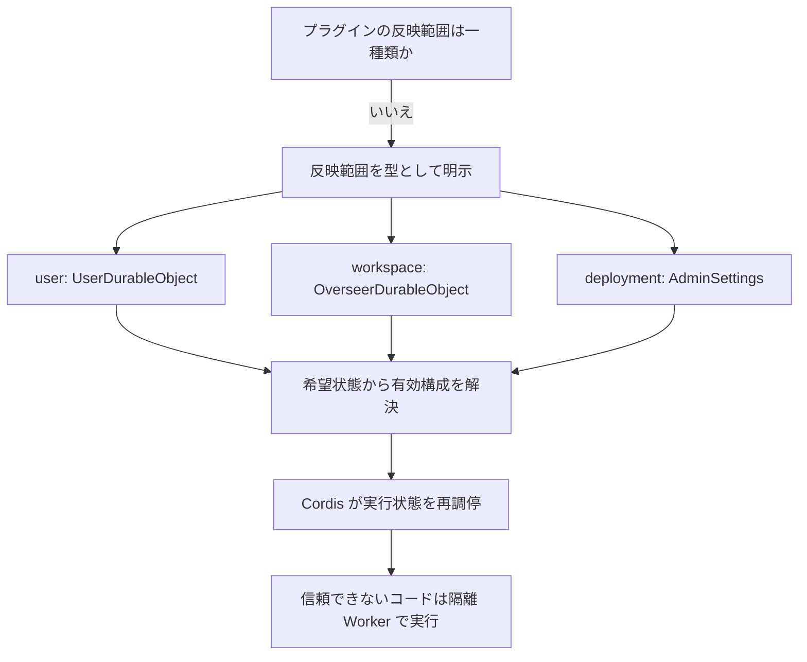

# ADR-001: Cordis プラグインの所有境界を型付きスコープで表現する

## 状態

**accepted** — 2026-08-15 に案C「型付きスコープ」と、その実装を拘束する派生契約を
grillingで確認し、確定しました。これは設計判断の確定であり、実装完了を意味しません。

## 判断対象

CloudflareOS に追加するプラグインについて、次の二つを誰の状態として所有するかを決めます。

1. インストール済み・有効・無効・版などの**希望状態**
2. 希望状態から再調停される Cordis の**実行状態**

Plugin Store の画面、課金、パッケージの物理形式、具体的な Cordis API の組み込み方は、
この ADR の判断対象ではありません。ただし所有境界を守るために必要な capability、隔離、版固定、
状態参照、失敗時挙動は派生契約として判断対象に含めます。

## コンテキスト

### 確認済みの現行境界

- `UserDurableObject` はユーザー情報、Agent、Skill、接続アカウントなど、ユーザー単位の
  永続状態を所有しています。
- `OverseerDurableObject` は一つのワークスペースの共同編集状態、権限、コード、Agent 実行を
  所有しています。
- `AdminSettings` はデプロイ全体の管理設定の正本です。
- 動的コードには既存の Worker Loader 経路があります。Cordis のコンテキスト分離は、この実行境界を
  置き換えるものではありません。
- Durable Object のメモリ状態は退避・再起動で失われます。終了フックの実行を前提にできないため、
  Cordis の実行状態を唯一の正本にはできません。

### プロダクト上の必須条件

- **個人選択**: 個人用テーマのように、本人だけが有効化するプラグインを表現できること。
- **共有整合性**: 共同レビュー規則のように、同じワークスペースの参加者へ同じ構成を適用できること。
- **管理者強制**: セキュリティ方針のように、利用者が解除できないデプロイ全体の構成を表現できること。
- **既存DO境界**: ユーザー状態を Overseer へ、共有状態を UserDO へ移して既存の所有意味を壊さないこと。
- **隔離実行**: 信頼できないコードを Cordis ホスト内で直接実行せず、別の実行境界へ置くこと。

## 意思決定ツリー



## 決定

プラグインのインストール対象を、次の閉じた型で明示します。

```ts
type PluginScope = "deployment" | "user" | "workspace";
```

希望状態の正本は、スコープが既に意味を持つ所有者へ保存します。

| スコープ | 希望状態の所有者 | 変更主体 | 反映対象 |
|---|---|---|---|
| `deployment` | `AdminSettings` | デプロイ管理者 | ハブ全体 |
| `user` | `UserDurableObject` | 対象ユーザー | そのユーザーの環境 |
| `workspace` | `OverseerDurableObject` | ワークスペース上の許可された主体 | そのワークスペースの参加者 |

Cordis のコンテキストと Fiber は、各所有者の永続状態から再構築できる実行時投影として扱います。
希望状態を先に永続化し、その差分からロード・停止・再配線します。Durable Object の退避後は、保存された
希望状態から同じ構成を再調停します。

プラグインコードには所有 Durable Object の `env` やルートコンテキストを渡しません。必要な能力だけを
明示的に渡し、信頼できないコードは Worker Loader または同等以上の隔離 Worker で実行します。

UI contributionでもこの境界を緩めません。単純UIは閉じた宣言スキーマをhostが直接描画します。
任意UI artifactは、`env`とambient networkを持たずCPU・subrequest・wall-clock上限をhostが固定した
Dynamic Worker内だけで実行します。worker内とhost側で二重検証した閉じた表示documentだけを、
script-freeのsandboxed iframeへ渡します。ブラウザへplugin JavaScript、RPC capability、DO stubは渡しません。

### インストール記録・manifest・実行アダプタ

- Storeのmanifestは、プラグインID、版、digest、要求capability、UI contribution、依存関係などを表す
  不変のパッケージ記述です。ユーザーのインストール希望状態の正本ではありません。
- `user`スコープではUserDOが`pluginId`、固定版、manifest digest、`enabled`、承認済みgrant、設定、
  必要なら`stateRef`を宣言的なインストール記録として所有します。`workspace`と`deployment`でも、
  同じ形の記録をそれぞれOverseerDOとAdminSettingsが所有します。
- Cordisホストには、manifestを検証して隔離Workerへ限定capabilityを渡す、信頼された汎用アダプタだけを
  ロードします。未信頼のプラグインコードはロードしません。

### プラグイン固有状態（Q15）

プラグイン一つ一つを専用Durable Objectクラスにしません。状態を持たないUI・変換・オーケストレーション
プラグインは、追加のDurable Objectを持たずに実行できます。

プラグイン固有の永続データが必要なインストールだけ、ホストが汎用`PluginStateDurableObject`の
インスタンスを割り当てます。インスタンスは概念上
`{ scope, targetId, pluginId, installationId }`で識別し、所有DOのインストール記録には不透明な
`stateRef`だけを保存します。プラグインコードへDO stub、storage、`env`は直接渡さず、manifestで承認された
状態操作capabilityだけを渡します。

したがって、Skill A/Bチャット比較プラグインでは、使い捨て比較は既存UserDOとAgent Preview Overseerだけで
成立します。比較履歴、勝敗、評価、注釈を保存する操作をユーザーが選んだ時だけ、汎用PluginState DOへ
比較固有データを保存します。

### スコープ重複時の安全性とdeployment強制の意味

異なる有効スコープに同じ`pluginId`が現れた場合、いずれかを暗黙採用せず、そのrealmの新しい実行構成を
全体として拒否します。既に動くrealmでは旧構成を維持し、新規realmではプラグインruntimeを起動しない
安全状態でハブ自体は利用可能にします。重複を空配列やscope優先順位へ変換しません。

`deployment`の「強制」は、一般利用者がその希望状態を変更・解除できないことを意味します。ただし、
未信頼runtimeであるdeploymentプラグインを、認証・認可・denylist・capability gateなどの唯一の
セキュリティ境界にはしません。停止や構成衝突があっても維持必須の安全方針は、信頼されたhost側で独立に
強制します。したがって、一般利用者が重複を作ってもhostのセキュリティ制御は弱まりません。

## 理由

ユーザー所有だけでは、共同レビュー規則を全参加者へ同じ構成として適用できません。ワークスペース所有だけでは、
個人用テーマまで共同編集者へ波及します。どちらも管理者が強制するセキュリティ方針を、同じ所有規則の中で
表現できません。

型付きスコープでは、個人設定・共有状態・管理方針を、それぞれ既に対応する認可と永続化の境界へ置けます。
このため、個人の自由を保つために共有状態を不定にしたり、共有の再現性を保つために個人設定を強制したりせずに
済みます。また、Cordis をセキュリティ境界として過大評価せず、構成の再調停とコード実行の隔離を分離できます。

## 代替案

### 案A: すべてユーザー所有

採用しません。個人選択には適合しますが、同じワークスペースでメンバーごとに実行構成が変わり、共有規則の
再現性を保証できません。管理者強制には別の例外経路が必要になり、「すべてユーザー所有」という規則自体が
成立しなくなります。

### 案B: すべてワークスペース所有

採用しません。共有整合性には適合しますが、個人用UIや補助機能まで他の参加者へ強制します。同じユーザーでも
ワークスペースごとに再設定が必要となり、ユーザーのマイルームという要件を表現できません。管理者強制にも
別の例外経路が必要です。

## 帰結

### 利点

- 変更の影響範囲が `scope` から一意に追跡できます。
- 既存の UserDO、OverseerDO、AdminSettings の認可・永続化境界へ収斂できます。
- 個人の自由、共同編集の再現性、管理者の安全方針を同時に表現できます。
- Durable Object の退避と Cordis の明示的 teardown を別の事象として扱えます。
- Cordis の API が変わっても、永続化された所有モデルは Cordis に依存しません。

### コストと制約

- 同じ `pluginId` が複数スコープに現れる場合の解決規則が必要です。
- Store UI はインストール先と影響範囲を明示する必要があります。
- 権限検査は `scope` ごとに異なり、単一の「インストール可能」判定にはできません。
- 実行状態と希望状態を分けるため、ロード成功だけを保存状態として扱えません。

## 仮定

- すべてのインストール記録は、対象を曖昧に推測せず `scope` と対象IDを明示します。
- `deployment` の希望状態は管理者用 capability からのみ変更できます。
- `workspace` の希望状態は、Overseer が持つ既存の権限検査を通過した操作だけが変更できます。
- `user` の希望状態は対象 UserDO が認証した本人の操作だけが変更できます。
- Cordis は構成とライフサイクルを管理し、未信頼コードのセキュリティサンドボックスには使いません。
- Durable Object の再生成時に、希望状態から Cordis の実行状態を再構築できる設計にします。
- Store manifestは内容アドレス可能で、固定versionとdigestから同じ宣言を再取得できると仮定します。
- ホストはcapability、resource ceiling、auditをプラグインコードより外側で強制できると仮定します。
- 汎用PluginState DOで必要な分離と負荷を満たせることは仮定です。容量検証に失敗した場合は、
  state APIを保ったまま物理配置を分割します。

## 確定した派生契約

| # | 契約 |
|---:|---|
| 1 | `deployment`プラグインは管理者が強制し、一般利用者は解除できません。 |
| 2 | `build` collaboratorは承認済みcapability範囲内でのみ`workspace`プラグインを変更でき、capability拡張はowner承認です。 |
| 3 | 所有DOの宣言的インストール記録をSSOT、Store manifestを不変パッケージ記述、Cordis側を信頼済み汎用アダプタとします。 |
| 4 | 有効スコープ間で同じ`pluginId`が重複する構成は拒否し、暗黙の優先順位で上書きしません。 |
| 5 | capabilityは項目単位で承認してインストール記録へ保存し、追加要求時は再承認します。 |
| 6 | versionとmanifest digestを固定し、更新は明示操作とします。 |
| 7 | 単純UIは宣言スキーマをhostが描画します。任意UI artifactは制限付きDynamic Worker内だけで実行し、二重検証した閉じた表示documentだけをscript-freeのsandboxed iframeへ渡します。 |
| 8 | 更新候補の起動に失敗した場合は旧版を維持し、候補だけをfailedとします。 |
| 9 | 障害はプラグイン単位で隔離し、ハブ全体を停止しません。 |
| 10 | uninstallはgrant失効とruntime停止を先に行い、状態はdetachして明示purgeまで保持します。 |
| 11 | 依存プラグインを自動インストールせず、不足時はsuspended、循環依存は拒否します。 |
| 12 | 管理者はmanifest digestのdenylistで既知の危険版を停止できます。 |
| 13 | AI生成物は証拠と署名付き候補とします。既承認範囲内の隔離されたuser/workspace候補は自動公開可、deploymentまたは新capabilityは管理者承認です。 |
| 14 | activation中に獲得した資源はteardown対象とします。過去の外部効果はuninstallで巻き戻さず、明示されたdomain compensatorだけが補償します。 |
| 15 | 永続データが必要なインストールだけ汎用PluginState DOを`stateRef`で参照し、無状態プラグインに追加DOは作りません。 |
| 16 | ambient `fetch`は禁止し、承認済みGatekeeper／egress capabilityだけを使います。 |
| 17 | userプラグインがworkspace共有状態を変えるには、明示的なforeground操作、workspace capability、認可、auditを必須にします。 |
| 18 | hostがインストール単位のCPU・メモリ・リクエスト等の上限を強制します。 |
| 19 | hostがappend-only auditを所有し、プラグイン自身に監査記録の編集権限を渡しません。 |
| 20 | 不可逆purgeの権限はuser本人、workspace owner、deployment adminに限定します。 |

### 2026-08-16 運用ゲート: AI authorityを配布しない

派生契約13は将来のcandidate審査モデルを定義しますが、現在のagentへ自己進化authorityを与える決定では
ありません。人間レビューStoreの実証段階では、agent tool catalog、system context、Skill、実行envへ
plugin生成／公開／install tool、manifest／artifact、publisher capability、Store bindingを一切追加しません。

永続manifest、内容アドレスartifact、隔離testの継ぎ目は将来再利用できます。ただし解禁時には別ADRまたは
本ADRの追補で、candidate生成主体、証拠、review、署名、公開権限を改めて決定します。それまでは
authorityが存在しないdefault-denyを正本とします。

## 残る実装選択

次は上記契約を変えない範囲の、現在も将来条件に依存する実装選択であり、このADRでは固定しません。

- 現在のPluginState quotaを越えた場合のsharding、D1/R2への退避条件
- 現在のDynamic Worker LoaderからWorkers for Platformsへ移行する条件
- Storeの検索・レビュー画面、課金、ランキング

## 実装追補（2026-08-23）

このADRを変更せず、実装計画の後続hardeningで次を具体化しました。

- `cordis@4.0.0-rc.8`を固定し、trusted adapterからDynamic Workerを調停します。
- 汎用PluginState DOはowner刻印、revision CAS、64 key、64KiB/value、256KiB/installをhost側で強制します。
- content-addressed PluginStore DOはmanifest／artifactのdigest、ECDSA P-256署名、隔離test evidenceを検証し、
  非公開candidateのstageと原子的publishを分離します。
- AI候補pipelineは生成主体へStore／署名／install authorityを渡さず、deploymentまたは新capability要求を
  承認待ちにします。現在のagent tool catalog／contextにはこのpipelineを公開しません。
- runtime状態と失敗は安全なprojectionとして利用者へ表示し、host-owned append-only auditへ永続化します。
- UI worker RPCは同時実行／頻度／lease／wall-clockをhost側で制限し、timeout時にin-flight RPCをdisposeします。

実装checkpointは`756cbf0`、詳細と検証件数は
[`plugin-system-implementation-plan.md`](./plugin-system-implementation-plan.md)を正本とします。

## 対象外

- Plugin Store の検索・購入・レビュー・配布画面
- AI がコードを生成して Store へ提出するワークフロー
- プラグインパッケージのファイル形式
- D1、KV、Durable Object をプラグインへ公開する具体的なAPI
- UIの無停止更新方式やHMRプロトコルの詳細
- 既存 Gadget／Gatekeeper の移行計画

## 不変条件

- 希望状態を所有 Durable Object へ先に永続化します。
- Cordis の実行状態は永続状態から再構築可能にします。
- 信頼できないコードを Cordis ホスト内で直接実行しません。
- Cordis の `ctx.isolate()` をセキュリティ境界として扱いません。
- プラグインへ、宣言・認可されていない capability を渡しません。
- スコープを推測せず、インストール記録に明示します。

## 最初の検証

最初の垂直スライスは、特定のプラグイン機能を作ることではなく、`user`スコープの希望状態を
UserDOへ保存して再取得できる制御プレーンです。

1. 信頼されたバックエンド境界から、固定version/digest、grant、設定を持つ宣言的インストール記録を
   UserDOへ保存します。
2. 同じUserDOの公開RPCから読み戻すと、保存した記録が同一内容で得られます。
3. 別ユーザーのUserDOからは、その記録を観測できません。
4. `stateRef`はプラグインやブラウザ入力から設定できず、後続のhost管理状態APIだけが付与できる契約にします。

Store manifest検証、ブラウザのインストールUI、Cordis再調停、PluginState DO、workspace／deploymentスコープは、
この保存経路がGREENになった後に、それぞれ一つの垂直スライスとして追加します。

## 参照

- [意思決定ワークベンチ](./cloudflareos-cordis-ownership-decision.html)
- [Skill A/Bチャット比較プラグインのデータフロー](./skill-ab-chat-plugin-data-flow.html)
- `cloudflare-os/packages/workshop-backend/src/user.ts`
- `cloudflare-os/packages/workshop-backend/src/overseer.ts`
- `cloudflare-os/packages/workshop-backend/src/admin-settings.ts`
- `cloudflare-os/packages/workshop-backend/wrangler.jsonc`
- [Cordis](https://github.com/cordiverse/cordis)
- [A Programming Paradigm for Spatiotemporal Composability](https://github.com/cordiverse/paper)
- [Cloudflare Durable Object lifecycle](https://developers.cloudflare.com/durable-objects/concepts/durable-object-lifecycle/)
- [Cloudflare Workers for Platforms](https://developers.cloudflare.com/cloudflare-for-platforms/workers-for-platforms/)

## 意思決定の入力

2026-08-15、意思決定ワークベンチとgrillingから次の内容を受領しました。

- 決定: 案C「型付きスコープ」
- 個人用テーマ: `user`
- 共同レビュー規則: `workspace`
- セキュリティ方針: `deployment`
- 必須条件: 個人選択、共有整合性、管理者強制、既存DO境界、隔離実行
- Q1〜Q14とQ16〜Q20: 推奨案を採用
- Q15: A/Bチャット比較の具体例で無状態経路と任意永続化経路を確認後、推奨案を採用
