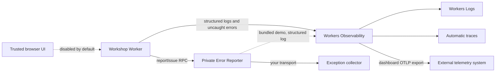

# Observability and error reporting

Every Worker here writes structured logs with `console.*`, and the runtime adds uncaught exceptions. Both land in [Workers Observability](https://developers.cloudflare.com/workers/observability/), which can export logs and traces to any OTLP endpoint from the Cloudflare dashboard. That is the default path for getting telemetry into an external system, and it needs no code in this repository.

The Error Reporter is the escape hatch. Upstream `reportIssue()` calls cross an RPC boundary into a private Worker you own, so exception events can go to an exception collector that groups occurrences, tracks releases, and pages someone. Browser reporting is a third input, privacy-sensitive and off by default.



## Choose the signal

| Signal | Best for | Produced by | Starter default |
| --- | --- | --- | --- |
| Structured application logs | Lifecycle, decisions, handled degradation, debugging | Producer Worker `console.*` calls | Enabled |
| Uncaught exceptions | Crashes not handled by application code | Workers runtime | Enabled |
| Explicit issue reports | Known failure sites that deserve cross-service triage | Upstream `reportIssue()` calls through RPC | Enabled for the Workshop backend |
| Invocation logs | One runtime record per invocation | Workers runtime | Disabled to control volume |
| Automatic traces | Timing and dependency paths across bindings/storage | Workers runtime | Disabled until sampling is chosen |
| Browser reports | Trusted first-party UI exceptions | Same-origin browser endpoint | Disabled |
| Source maps | Mapping generated stack frames to source | Wrangler/build pipeline | Destination-specific |

Error reporting does not replace logs or traces. The default Reporter sees only explicit `reportIssue()` calls. It cannot catch an exception that terminates a Worker before a capture site, and it does not turn every `console.error()` into an issue.

## Quick start

The annotated [`deployment.jsonc`](../deployment.jsonc) enables the backend Reporter by default:

```jsonc
"workers": {
  "errorReporter": { "name": "your-cloudflare-os-errors" }
},
"errorReporting": {
  "enabled": true,
  "environment": "production",
  "release": null
}
```

Deployment creates a private [`packages/error-reporter`](../packages/error-reporter/README.md) Worker and binds the Workshop to its `ErrorReporter` RPC entrypoint. No route, public hostname, credential, or vendor account is required.

The bundled implementation writes each event as one structured `console.error()` object. That demonstrates the collection path and gives you a queryable destination on the first deploy. Send the events somewhere richer when you want grouping, release tracking, and alerting; see [Replace the destination](../packages/error-reporter/README.md#replace-the-destination).

To read what the bundled implementation collects:

1. Open [Workers & Pages](https://dash.cloudflare.com/?to=/:account/workers-and-pages), select the configured Error Reporter Worker, then open **Observability**.
2. Filter structured fields with the Query Builder. Start with `event = error_report`, then narrow by `service`, `environment`, `release`, `failureSite`, `severity`, or `handled`.
3. Use `occurrenceId` for one event and correlation/attribute fields to reconnect it to producer logs.
4. Use [`wrangler tail`](https://developers.cloudflare.com/workers/observability/logs/real-time-logs/) for live reproduction.

Set `release` to the deployed commit or release identifier when your pipeline has one. Keep it `null` rather than inventing a value when it does not.

To turn explicit issue forwarding off, set `errorReporting.enabled` to `false`. The Reporter is not built or deployed, the service binding is omitted, and upstream `reportIssue()` calls become their designed no-op. Normal producer logs and uncaught exceptions continue.

## Structured logs

[Workers Logs](https://developers.cloudflare.com/workers/observability/logs/workers-logs/) indexes object fields passed to `console.log()`, `console.warn()`, and `console.error()`. Prefer one event object with a stable discriminator over interpolated prose:

```ts
console.error({
  event: "sync.failed",
  operation: "context.sync",
  durationMs,
  error,
});
```

Use consistent event names and bounded scalar context. Log at `error` when action is required, `warn` for best-effort degradation, `info` for notable lifecycle events, and `debug` for noisy breadcrumbs. Do not log whole requests, responses, model prompts, credentials, or arbitrary user data.

The Error Reporter intentionally flattens the normalized event and trusted producer props into one object. This makes high-value fields directly queryable and preserves the upstream event's occurrence ID, timestamp, exception, truncation marker, HTTP facts, correlation IDs, and attributes.

## Sampling and traces

The deployment controls apply consistently to the Workshop, Context, custom Gatekeeper, and Error Reporter:

```jsonc
"observability": {
  "enabled": true,
  "headSamplingRate": 1,
  "logs": { "invocationLogs": false },
  "traces": { "enabled": false, "headSamplingRate": 0.1 }
}
```

- `headSamplingRate` accepts `0` through `1` and controls eligible observability telemetry.
- `logs.invocationLogs` adds runtime invocation records. Keep it off unless those records answer a question your structured application logs cannot.
- `traces.enabled` turns on [automatic tracing](https://developers.cloudflare.com/workers/observability/traces/). Start with a measured sample such as `0.1`, inspect volume and usefulness, then tune it.
- `traces.headSamplingRate` is independent so traces do not need the same volume as logs.

Sampling can hide individual events. Use full sampling during an incident or initial evaluation when volume permits, but do not promise that a sampled telemetry pipeline records every request.

## Source maps

[Worker source maps](https://developers.cloudflare.com/workers/observability/source-maps/) let Cloudflare remap uncaught Worker stack traces after an invocation. They are not available inside the Worker at runtime, so a stack copied into an explicit Reporter event remains the stack available at capture time.

Browser source maps need a destination-specific workflow. Upstream can generate hidden maps when `VITE_FRONTEND_ERROR_REPORTING=true`, but a production pipeline must upload them to the selected destination and ensure they are not served as public static assets. The starter does neither implicitly.

Record a stable `release` when uploading maps so the destination can select the matching artifact. Test symbolication with a deliberate non-sensitive error before relying on it during an incident.

## Browser reporting

Browser reporting is intentionally disabled. Enabling it safely requires all of the following:

1. Build trusted first-party surfaces with `VITE_FRONTEND_ERROR_REPORTING=true`.
2. Bind `FRONTEND_ERROR_REPORTER` to a private Reporter entrypoint.
3. Bind `FRONTEND_ERROR_RATE_LIMITER` with a unique Rate Limiting namespace and an intentional limit.
4. Keep reports on the existing same-origin `POST /api/client-errors` path so the deployment's sign-in identity, origin checks, payload limits, and normalization remain in force.
5. Upload hidden source maps to the chosen private destination, then remove them from static deployment assets.
6. Define retention, access, and deletion policy for browser stacks and coarse browser facts.

The backend treats browser input as untrusted diagnostic data. Gatekeeper/configurator frames report through their known parent window; do not add direct cross-origin reporting from Worker-hosted frames, and never collect errors from gadget-authored/user-authored code automatically.

## External destinations

Workers Observability exports on its own. Reach for the Error Reporter only when exception events need handling that a telemetry pipeline does not give them.

| Need | Path |
| --- | --- |
| Logs and traces in an external observability system | [OpenTelemetry export](https://developers.cloudflare.com/workers/observability/exporting-opentelemetry-data/) from the Cloudflare dashboard |
| An existing log pipeline | [Workers Logpush](https://developers.cloudflare.com/workers/observability/logs/logpush/) |
| Processing events in code before they leave the account | A [Tail Worker](https://developers.cloudflare.com/workers/observability/logs/tail-workers/) |
| Exception grouping, release tracking, and alerting | [Replace the transport](../packages/error-reporter/README.md#replace-the-destination) inside `packages/error-reporter` |

The first three need no code in this repository, and Sentry, Honeycomb, and Grafana all accept OTLP. Replacing the Reporter transport is worth it when exception events need destination-specific grouping, release handling, or alerting.

Error reporting is not an alerting policy. Configure alerts in the system that owns the retained signal, and alert on actionable rates or service-level symptoms rather than every occurrence.

## Security and privacy

Exception messages and stacks may contain sensitive data even when nobody intended to log it.

- Never put secrets, prompts, tokens, cookies, authorization headers, request/response bodies, or raw user documents in thrown errors or report attributes.
- Keep Reporter Workers private and reachable only by service binding.
- Use the minimum retention and destination access needed for incident response.
- Treat browser metadata, failure sites, and correlation values as diagnostics, never identity or authorization.
- Review external export regions, subprocessors, deletion behavior, and access controls before enabling a destination.
- Prefer identifiers over payloads. Look up protected business data in its system of record after authorization.

The upstream contract bounds strings and scalar attribute counts and refuses to traverse arbitrary thrown objects. That limits accidental volume; it is not a substitute for keeping sensitive material out of errors.

## Troubleshooting

| Symptom | Check |
| --- | --- |
| No Error Reporter Worker | `errorReporting.enabled`, Worker name, and deploy output |
| Reporter exists but has no events | Confirm the failure crossed an explicit upstream `reportIssue()` capture site; inspect producer logs for uncaught or differently handled failures |
| `error_report.dispatch.failed` in producer debug logs | Reporter service name/entrypoint, deployment order, and Reporter Worker availability |
| Reporter invocation succeeds but query is empty | Observability enablement, sampling, time range, selected Worker, and external export settings |
| Wrong environment/release | Service-binding props in the generated Workshop config; redeploy all affected Workers together |
| Stack does not map to source | Matching source map/release, map upload, generated filename, and whether the stack came from runtime or explicit reporting |
| Browser endpoint returns no report | This is expected by default; both the reporter and rate-limiter bindings are required before it dispatches |

## Production checklist

- Give every deployment a stable environment label and every releasable build a release identifier.
- Verify one synthetic, non-sensitive explicit report after deployment.
- Confirm the Reporter has no public route.
- Confirm logs/traces are retained or exported where responders actually look.
- Add an actionable alert outside the Worker when the destination supports it.
- Document sampling changes during incidents.
- Test source-map symbolication before an incident.
- Recheck privacy and retention whenever browser reporting or a third-party destination is enabled.
