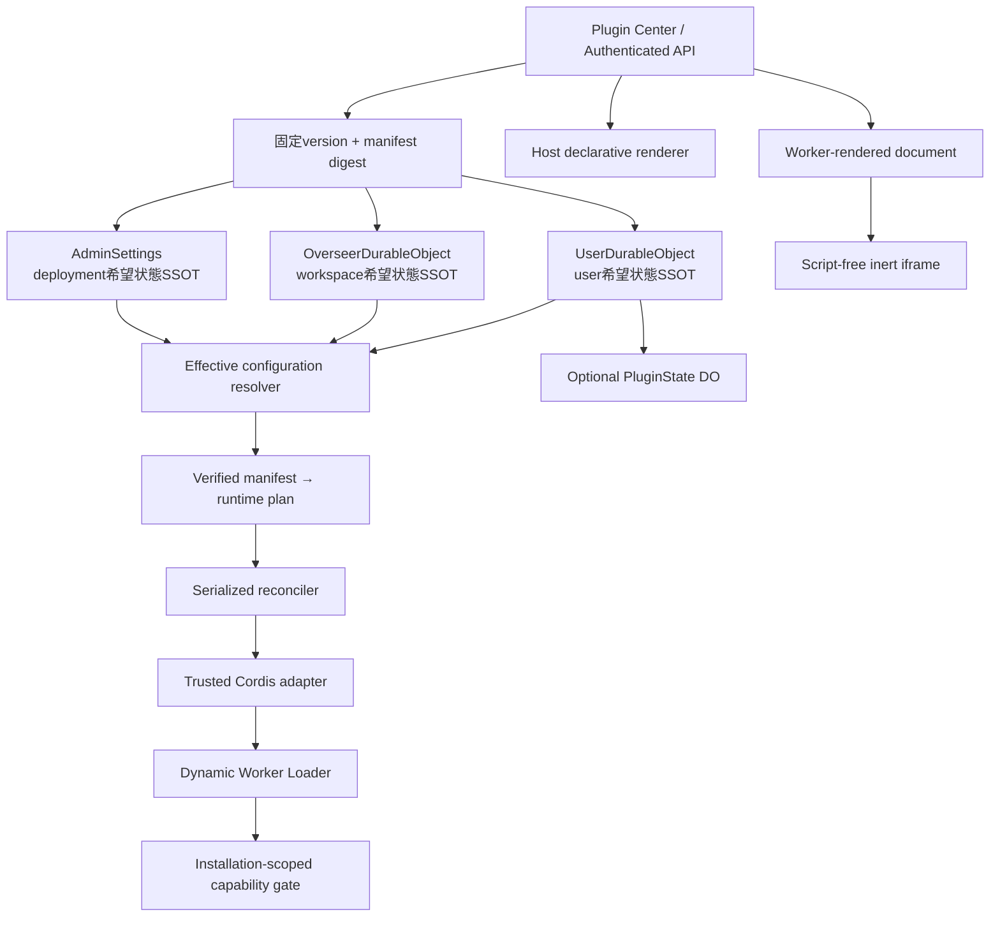
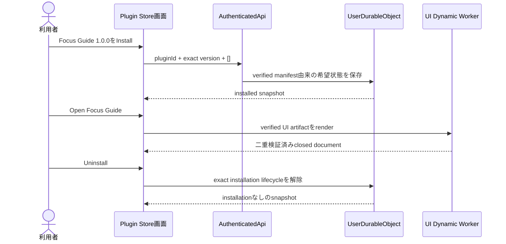

# CloudflareOS × Cordis プラグイン基盤 実装計画

## 結論

[`ADR-001`](./adr-001-plugin-ownership-scopes.md) で確定した型付きスコープと20の派生契約を、
11本の垂直スライスとして実装しました。submodule branchは`codex/plugin-control-plane`、
Plugin Center coreのcheckpointは`484de71`、人間レビューStore tracerを含む最終checkpointは`7b00964`です。
push／deployはしていません。

Skill A/Bチャット比較はQ15を説明する例であり、個別プラグインとしては実装していません。

## 実装後の全体像

## 完了した11スライス

| # | スライス | 実装した契約 |
|---:|---|---|
| 1 | user希望状態 | UserDOがscope／target／installation ID／stateRefをhost刻印し、希望状態・audit・sequenceを原子的に保存 |
| 2 | 不変manifest | schema別canonical bytes、SHA-256、exact version、build-time generator、重複・未知field・不正UTF-8拒否 |
| 3 | authenticated install | browserはplugin ID／exact version／承認capabilityだけを渡し、digest等はhost解決 |
| 4 | workspace registry | Overseerの既存owner／build／use capabilityを利用し、capability拡張をownerだけに限定 |
| 5 | deployment registry | AdminApiだけがAdminSettingsの希望状態を変更し、一般利用者へ解除面を公開しない |
| 6 | effective configuration | 3 scopeの有効plugin ID重複を全体拒否し、暗黙優先順位を持たない |
| 7 | reconciler | activeとfailed candidateを同時表現し、旧版・依存closure維持、consumer-first teardown、plugin単位失敗隔離 |
| 8 | Cordis adapter | `cordis@4.0.0-rc.8`を固定し、host-owned retryable cleanup ledgerでCordis disposeの例外吸収を補完 |
| 9 | isolated runtime | Dynamic Worker、ambient network拒否、closed capability catalog、realm／generation／lease epoch、denylist、DO再構築時default deny |
| 10 | optional state | stateful user installだけ汎用PluginState DOを割当。uninstall時detach、明示purge、crash-resumable saga、ABA防止 |
| 11 | UI contribution | Plugin Center read model、host宣言UI、制限付きWorker renderer、二重検証済みclosed document、script-free inert iframe |

## 重要な不変条件

- 希望状態は、CordisやWorkerを起動する前に所有DOへ永続化します。
- 実行状態は永続化せず、3つの所有SSOTから再構築します。
- Cordisはライフサイクル調停だけを担当し、セキュリティ境界にはしません。
- 未信頼コードへ所有DO stub、raw storage、`env`、`stateRef`を渡しません。
- capabilityはmanifest要求、所有DOの現在権限、realm gate、lease epochを各callで照合します。
- 更新候補失敗時は旧版を維持し、失効対象と無関係なpluginは継続します。
- uninstallは永続tombstoneでgrantを先に失効し、状態をdetachしてから明示purgeまで保持します。
- UI artifactはbrowserで実行しません。Dynamic Worker内でclosed documentへ縮約し、hostが再検証します。

## UI実行境界

`worker-rendered-document-v1`は、任意DOM／ブラウザJavaScriptを意味しません。

1. content-addressed artifactを再hashします。
2. `env: {}`、`globalOutbound: null`、`disallow_importable_env`、CPU 50ms、subrequest 1、
   wall-clock 5秒のhost固定Worker定義で実行します。
3. plugin import前に捕捉したintrinsicだけを使い、prototype汚染に依存しないloopで表示documentを検証します。
4. worker出力を256KiB以内の閉じたtext／notice／listへ投影します。
5. hostが同じschemaを再検証し、owner lifecycleとdenylistをI/O後に再確認します。
6. browserにはescaped HTMLだけを返し、`sandbox=""`とscript／worker／network拒否CSPで表示します。

実workerd testでは、有効renderer、永久にsettleしないrenderer、prototype汚染rendererを通し、
失敗時もPlugin Centerと他rendererが継続することを確認しました。

## 人間レビューStoreの実証

11スライスの後続確認として、default production catalogへ
`circle.focus-guide@1.0.0`を追加しました。これは稼働中のupload／publish APIではなく、review済みの
manifest、runtime artifact、UI artifactをbuild時に内容アドレス化するdeployment-local Storeです。
利用者は既存の`/plugins`からexact versionをinstallし、隔離Workerで生成されたFocus Guide表示を開き、
uninstallで元へ戻せます。

視覚証拠:

- [導入前](./plugin-store-before.jpg)
- [導入後](./plugin-store-installed.jpg)
- [Focus Guide実行](./plugin-store-focus-guide-open.jpg)
- [解除後](./plugin-store-after-uninstall.jpg)
- [Remotion説明動画（47秒・日本語ナレーション）](./plugin-store-focus-guide-demo-remotion.mp4)

動画は画面状態を順に並べるだけでなく、連続ズーム、操作カーソル、3ステップの逐次表示、
artifactから画面までの処理フロー、uninstall遷移をRemotionで合成しています。また、Focus Guideの実機能は
「25分集中の手順パネル」であり、タイマー実行やタスク保存ではないことを映像内で明示します。

稼働中のpublisher、外部artifact Store、署名、review queue、atomic publishはこのtracerには含めません。
同じmanifest／artifact portへ後続adapterを追加できる状態ですが、必要性を観測するまで権限面を増やしません。

## Stateful sidebar pluginの実証

二つ目のproduction packageとして`circle.personal-kanban@1.0.0`を追加しました。これはFocus Guideの
静的なdetails contributionとは異なり、installするとサイドバーへ`Kanban`が現れ、専用routeから
タスクの作成、列間移動、削除を行えます。ボードは1 installationにつき1つで、`To do / Doing / Done`
の3列をartifact側のpure reducerが管理します。

状態の正本はWorker memoryではなくuser-owned PluginState Durable Objectです。各mutationは
`expectedRevision + mutationId`付きCASで保存され、同じmutationの再送は一度だけ適用されます。
uninstallはowner tombstoneを先に置いて新規操作を拒否し、stateをdetached lifecycleへ保持します。
再installは新しいinstallation IDと空のboardから始まるため、旧stateが混ざりません。

視覚証拠:

- [実アプリのDoing状態](./plugin-kanban-doing.png)
- [Remotion動画poster](./plugin-kanban-demo-poster.jpg)
- [Remotion操作動画（42秒・1280×720・30fps）](./plugin-kanban-demo-remotion.mp4)

動画は静止画の切替ではなく、install後のsidebar entry出現、route遷移、文字入力、カード生成、
To doからDoingへの連続移動、再読込後の永続状態、実アプリ画面への接続をframe単位で合成しています。
検証器は2fps標本84枚中81枚が一意であることを確認します。

## 現在のプラグイン化範囲

Cordisの一般的な適用範囲ではなく、現在のCloudflareOSで実際にhost contractが存在する面だけを示します。

| 区分 | 現在プラグイン化されているもの | 現在固定coreのもの |
|---|---|---|
| 所有・配布 | user／workspace／deploymentの希望状態、exact manifest、build-time Store catalog | 稼働中publish、署名、review workflow |
| 実行 | `handshake()`／host起点`invoke()`、依存解決、更新、rollback、cleanup | agent loop、model呼出し、system prompt構築 |
| capability | `workspace.metadata.read`、`plugin.state.read`、foregroundの`plugin.ui.state.mutate` | agent tool catalog、外部サービスwrite capability |
| UI | Plugin Store detailsのclosed document、user plugin由来sidebar entry／host固定route、closed interactive columns／items／actions | chat分割、任意React／browser JavaScript |
| lifecycle | user install／uninstall／state purge、workspace／deployment install/update | workspace／deployment uninstall／purge parity |

したがって現在地は「安全に着脱できるkernelと最初の狭いcontribution面は実装済み」ですが、
エージェントに関わるほぼ全てがプラグイン化済みという状態ではありません。Agent／SkillのCRUDも、
現時点ではプラグインcontributionではなく固定coreの設定機能です。

## AI自己進化の運用ゲート

将来の自己進化を阻害する永続形式にはしていませんが、現時点ではAIへ次を一切渡しません。

- plugin生成／公開／install tool
- manifest、artifact、publisher capability、Store binding
- 自己進化用system contextやSkill

この条件は「disabled tool」やfeature flagではなく、agent tool catalogと実行envにauthority自体を存在させない
default-denyです。`CUSTOM_AGENT_TOOL_NAMES`にも該当名を追加せず、回帰テストで固定しました。
将来解禁する場合は、AI生成→隔離test→証拠付きcandidate→人間reviewという別Spaceを再決定します。

## TDDと独立レビュー

各スライスは公開継ぎ目をREDにしてから最小実装を追加しました。内部collection名やcall回数ではなく、
実workerd、公開RPC、再構築後の状態、capability失効を観測しています。

最終証拠:

- manifest generator: 18件 GREEN
- workshop backend unit: 472件 GREEN
- workshop backend integration: 26件 GREEN、環境依存4件skip
- workshop frontend: 139件 GREEN
- submodule lint／全workspace TypeScript: GREEN
- backend worker build、frontend production build: GREEN
- outer wrapper `pnpm check`: unit／typecheck／全Wrangler dry-run GREEN
- architecture／specification／next-slice reviewer: 残存BLOCKER 0

## 実装checkpoint

- `f086ff5`〜`4dee7c9`: user SSOT、manifest、audit、authenticated install
- `dc2512c`／`7b4d808`: workspace／deployment SSOT
- `c89f628`〜`79e6983`: effective configurationとreconciler
- `bf2c694`／`1d4943e`: dependency provenanceとCordis adapter
- `39a5b10`〜`cd390c6`: content-addressed artifact、Dynamic Worker、realm、gate、denylist、read capability
- `8e772a1`／`f94ddf4`: user PluginState lifecycleとpurge
- `484de71`: Plugin Center、manifest v4、declarative／worker-rendered UI
- `7b00964`: 人間レビューStore tracer、Focus Guide、AI authority非配布のmodel-seam回帰

## 今回の完了境界

この文書の11スライスは完了です。一方、初期ビジョン全体には次の別計画が残ります。
これは今回の完了を曖昧にする「あと少し」ではなく、accepted ADRで対象外または後続とした独立した仕事です。

- workspace／deploymentのuninstall・state detach・purge parity
- PluginState write／CAS／quotaと、診断以外のproduction capability catalog
- bundled catalogを越えるcontent-addressed Store、署名、evidence、approval、atomic publish
- AI生成→隔離test→署名付き候補→Store公開の自己進化ループ（現在はtool／context非配布）
- active／suspended／failedとruntime failure auditの利用者・運用者向け可視化
- UI renderの同時実行／頻度上限とtimeout後の物理cancelに関する運用hardening

これらを同じスライスへ先回りして混ぜず、次の意思決定でSpaceと受入条件を改めて固定します。

## 参照

- [ADR-001](./adr-001-plugin-ownership-scopes.md)
- [意思決定ワークベンチ](./cloudflareos-cordis-ownership-decision.html)
- [Skill A/Bチャット比較のデータフロー](./skill-ab-chat-plugin-data-flow.html)
- `cloudflare-os/packages/workshop-backend/src/plugin-effective-configuration.ts`
- `cloudflare-os/packages/workshop-backend/src/plugin-reconciler.ts`
- `cloudflare-os/packages/workshop-backend/src/cordis-plugin-runtime-adapter.ts`
- `cloudflare-os/packages/workshop-backend/src/dynamic-worker-plugin-activator.ts`
- `cloudflare-os/packages/workshop-backend/src/dynamic-worker-plugin-ui-renderer.ts`
- `cloudflare-os/packages/workshop-frontend/src/PluginCenterPage.tsx`
